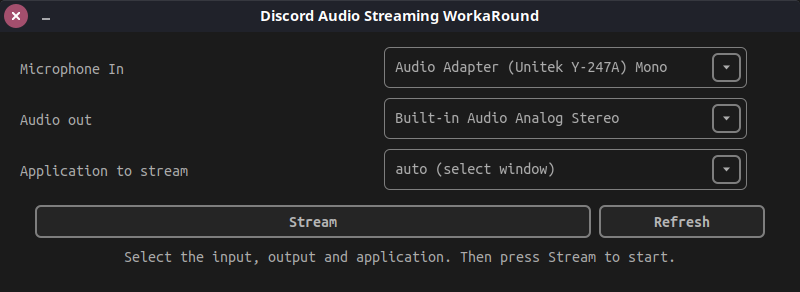

# Discord Audio Streaming WorkaRound




## Dependencies
`python3 python3-venv python3-pip`

## Usage

```bash
git clone --depth=1 https://github.com/daswr/daswr daswr
cd daswr
./DASWR.sh
```


## Note for apps using OpenALSoft

To stream apps using openAlSoft you need to create a file in `~/.alsoftrc` with this content
```bash
drivers = alsa,pulse,core,oss

[pulse]
allow-moves=yes
```
